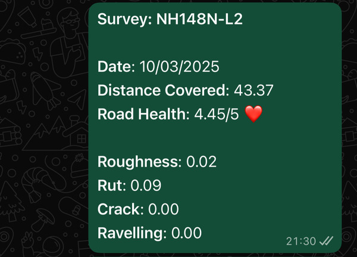
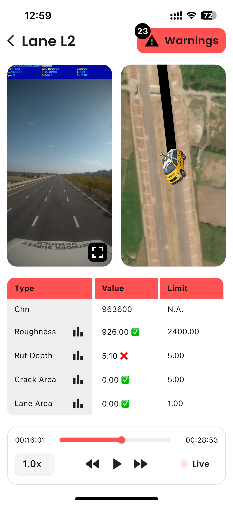
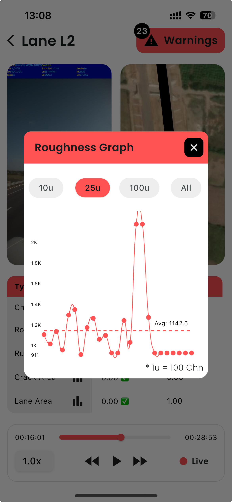
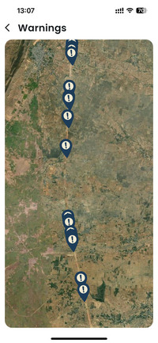
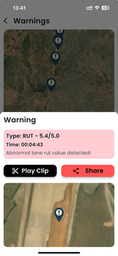
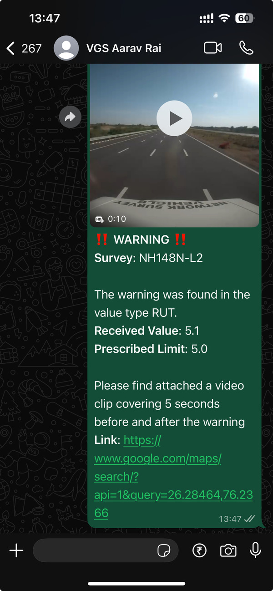

# NHAI Inspection Flutter App

> ⚡ Road Inspection. Reimagined. Realtime.

## 🔍 Overview

This Flutter app is the front-end companion to the NHAI Middleware engine, helping inspectors visualize video + sensor data in real time and spot issues quickly and clearly.

It syncs processed data from survey vehicles with video playback and maps, showing roughness, rutting, cracks, and ravelling live with warnings.

---

## 🌐 Features

- 🎥 Video playback synced with road sensor data
- 📍 Live road map with polylines and marker warnings
- 🔍 Abnormal value detection (roughness, rut, crack, ravelling)
- 📊 Dynamic graphs and warning history
- 📲 Native sharing of survey summaries and video clips
- ⌚ FlutterMap integration for offline/online tiles

---

## 📁 Project Structure
```
nhai_app/
├── assets/                  # Video, CSV, and images
├── lib/
│   ├── models/              # SurveyFrame, Warning, etc.
│   ├── screens/             # HomeScreen, SurveyScreen
│   ├── components/          # Custom UI components
├── pubspec.yaml
└── README.md
```

---

## 🗂️ Installation

### 1. Clone the repository
```bash
git clone https://github.com/pratyakshkwatra/nhai_app.git
cd nhai_app
```

### 2. Install dependencies
```bash
flutter pub get
```

### 3. Run the app
```bash
flutter run
```

Ensure that:
- You have an emulator or device connected
- Your assets (video, CSV, map images) are placed correctly in the assets/ directory

---

## 🌐 Screenshots









---

## 📅 Demo Flow

1. Select a survey from the list
2. See overview stats + road health
3. Inspect: video + map + sensor data sync
4. Warnings highlighted live
5. Tap marker for insights and share trimmed clip

---

## 👉 Contributions
We welcome feature requests, bug reports, or pull requests. This project was built for a better inspection workflow — join us to improve it.

## 🌿 License
MIT License.

---

Built with ❤️ for Indian Roads by Pratyaksh Kwatra & Aarav Rai.
