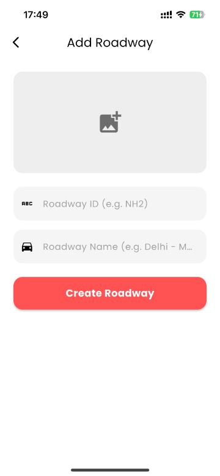
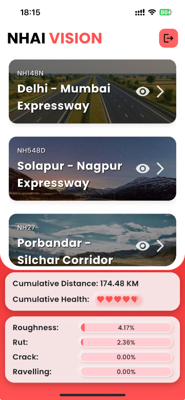

# NHAI Inspection Flutter App

> ⚡ Road Inspection. Reimagined. Real-time. Cloud-powered.

---

## 🔍 Overview

The **NHAI Inspection App** is the official frontend to our intelligent road inspection system, powered by a cloud backend (AWS hosted ([`nhai_backend`](https://github.com/pratyakshkwatra/nhai_backend)) ) and the OCR enabled ([`nhai_middleware`](https://github.com/pratyakshkwatra/nhai_middleware))  fusion engine.

Originally designed as a local only inspection tool, the app has evolved into a robust multi - user platform that connects **Admins** and **Inspection Officers** to survey data, video feeds, and real-time alerts — all through a central server.

The app enables seamless:
* **Survey uploads (video + sensor excel)**
* **Data fusion using our OCR engine**
* **Cloud-based processing and sharing**
* **Inspector access control**

---

## ✨ New Features (v2.0)

### 🧑‍💼 Authentication & User Roles

* **Admin & Inspection Officer** account types
* **Login system** and **admin account creation**
* Secure profile creation with username, password, and photo

### 🚣️ Roadway & Lane Management

* Admins can **create, search, edit, and delete** roadway entries
* Add roadway banners, ID (e.g., *NH148N*), and name
* Control officer access per roadway

### 📹 Lane Data Upload + Fusion

* Add lanes with direction (left/right) and lane number
* Upload survey vehicle **video + Excel sensor data**
* Server auto-compresses data and runs OCR-based fusion
* Ready-to-inspect output available post processing

### 🚁️ Smart Survey Inspection

* View **video footage synced with GPS & sensor data**
* Live **graphical + tabular display** of lane sensor info
* Interactive **FlutterMap** with:

  * GPS polylines
  * Warning markers for abnormalities

### ⚠️ Warning System & Playback

* Real-time abnormality detection (cracks, rutting, roughness, ravelling)
* When triggered:

  * Marker added on the map
  * Warning card appears in *Warnings* tab
  * Tap to view:

    * Clip (5s before + 5s after warning)
    * HD GPS data
    * Share Google Maps link + issue summary + video

---

## 🌐 Architecture

```
                        ┌───────────────────────┐
                        │   Flutter App         │
                        │ (nhai_app)            │
                        └──────┬────────────────┘
                               │ REST
                               ▼
                        ┌───────────────────────┐
                        │   Backend (FastAPI)   │
                        │   nhai_backend        │
                        └──────┬────────────────┘
                               │ Async Job Queue
                               ▼
                        ┌───────────────────────┐
                        │ Fusion Engine         │
                        │ (nhai_middleware)     │
                        └───────────────────────┘
```

---

## 📁 Project Structure

```
nhai_app/
├── assets/                  # Screenshots, images
├── lib/
│   ├── api/                 # HTTP client and endpoints
│   ├── auth/                # Login, registration, session
│   ├── models/              # Roadway, Lane, Warning, User
│   ├── screens/             # Admin panel, survey UI, login
│   ├── components/          # UI widgets
├── pubspec.yaml
└── README.md
```

---

## 🛠️ Installation

### 1. Clone the repository

```bash
git clone https://github.com/pratyakshkwatra/nhai_app.git
cd nhai_app
```

### 2. Install dependencies

```bash
flutter pub get
```

### 3. Run the app

```bash
flutter run
```

> ✅ Make sure your Flutter environment is set up and connected to a device/emulator. Internet access is required to connect to the backend.

---

## 📷 Screenshots








---

## 🔄 Update Log

### v2.0 — July 2025

* Transitioned from local-only app to cloud-connected system
* Introduced backend ([`nhai_backend`](https://github.com/pratyakshkwatra/nhai_backend)) and hosted server (AWS)
* Automated data fusion via ([`nhai_middleware`](https://github.com/pratyakshkwatra/nhai_middleware)) 
* Added login, user roles, and admin control
* Introduced full CRUD for officers and roadways
* Implemented lane-based uploads (video + Excel)
* Live GPS + warning playback with FlutterMap
* Video clipping and sharing for warning events

---

## ☛ Contributions

We welcome feedback, pull requests, and collaboration. This is an evolving project designed to improve road inspection at scale.

---

## 🌿 License

MIT License.

---

Built with ❤️ for Indian Roads by [Pratyaksh Kwatra](https://github.com/pratyakshkwatra) & [Aarav Rai](https://github.com).